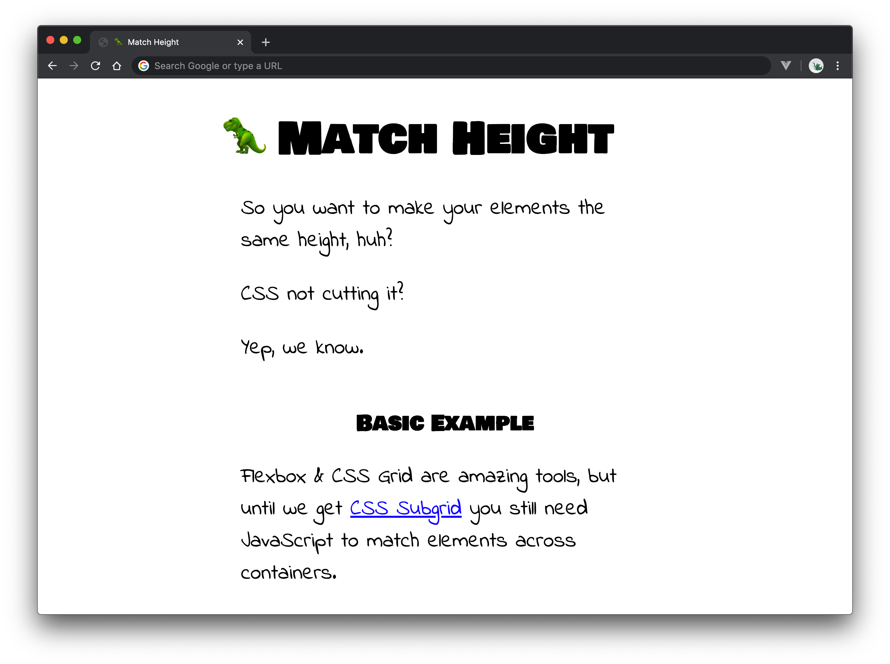

# 🦖 Match Height

Simple JavaScript plugin to make different elements the same height.

## ⚡️ Quick Start

1. `npm install @tannerhodges/match-height`
2. `import MatchHeight from '@tannerhodges/match-height';` _-- OR --_ `<script async src="match-height.js"></script>`
3. Add `data-match-height` to your elements.

---

## 📖 Outline

- [Why?](#-why)
- [Install](#%EF%B8%8F-install)
- [HTML API](#-html-api)
- [JavaScript API](#-javascript-api)
- [CodePen Examples](#%EF%B8%8F-codepen-examples)
- [Changelog](#-changelog)

## 🤔 Why?

Flexbox & CSS Grid are amazing tools, but until we get [CSS Subgrid](https://caniuse.com/#feat=css-subgrid) you still need JavaScript to match elements across containers.

Match Height makes this as easy as adding a `data-match-height` attribute.

👉 For a full explanation & demos, [check out the docs](https://tannerhodges.github.io/match-height/).

[](https://tannerhodges.github.io/match-height/)

## ⚙️ Install

1. Install the package.

```bash
npm install @tannerhodges/match-height
```

2. Import the package into your application script.

```js
import MatchHeight from '@tannerhodges/match-height';
```

Or, if you prefer, include the script in your HTML.

```html
<script async src="match-height.js"></script>
```

## 👨‍🏫 HTML API

- `data-match-height="<NAME>"` - Match this element's height other elements that have the same name.
- `data-match-height-group="<NAME>"` - Wrap around a group of elements so they're matched separately from other elements with the same name.
- `data-match-height-enable="<BOOLEAN_OR_MEDIA_QUERY>"` - Enable match height at a specific breakpoint.
- `data-match-height-disable="<BOOLEAN_OR_MEDIA_QUERY>"` - Disable match height at a specific breakpoint.

```html
<div class="example"
  data-match-height-group="example"
  data-match-height-enable="(min-width: 768px)">
  <div>
    <h3 data-match-height="heading">Person 1</h3>
    
  </div>
  <div>
    <h3 data-match-height="heading">Person 2</h3>
    
  </div>
  <div>
    <h3 data-match-height="heading">Person With a Long Name</h3>
    
  </div>
</div>
```

## 🤖 JavaScript API

- `MatchHeight.add(elements, [groupID])` - Add one or more elements to Match Height. By default, this adds elements to their own, unique group. Otherwise, it adds them to the group you specify.
- `MatchHeight.remove(groupOrElements)` - Remove one or more elements, or a whole group, from Match Height. In other words, "stop matching these." Removes the `data-match-height` attribute and inline `height` style from each element.
- `MatchHeight.update([groupOrElements])` - Update heights for all currently tracked elements, or only update a specific group of elements.
- `MatchHeight.reset()` - Reset Match Height. Find any elements with `data-match-height` and start matching them.
- `MatchHeight.debug([groupOrElements])` - `console.log` info about a group of elements. Shows whether a group is enabled, what element is controlling it, and what other elements are in the group.

```js
import MatchHeight from '@tannerhodges/match-height';

// Add elements to a new group
MatchHeight.add('.example h3', 'example-heading');

// The rest is up to you!
// 🏃‍♂️ Go make something!
```

## ✍️ CodePen Examples

- [Basic Example](https://codepen.io/tannerhodges/pen/593ba4f9811a53ed5b9f03f8890d6c52)
- [Responsive Example](https://codepen.io/tannerhodges/pen/699e29b01d4851ccde4052486cfec63c)
- [Single Page App Example 1](https://codepen.io/tannerhodges/pen/d38706e6bbc7ac61e2942ab4a3d292d6)
- [Single Page App Example 2](https://codepen.io/tannerhodges/pen/f0718f8b1649acb1c1d191564e0477e0)
- (The Future!) [CSS Subgrid Example](https://codepen.io/tannerhodges/pen/4458ebd15135b2848016510304247440) - _View in Firefox_

## 📝 [Changelog](changelog.md)
